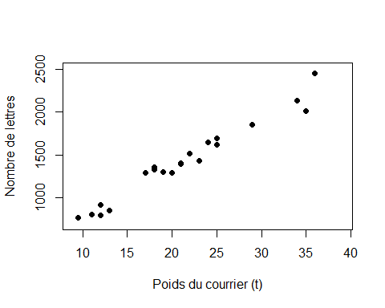

#Exercice 1 : 

##1/Lire le fichier de données Courrier.txt

```r
courrier = read.table("Courrier.txt")
colnames(courrier)=c("Poids","Nb_lettres")
attach(courrier)
```

##2/

```r
plot(Poids,Nb_lettres,xlab="Poids du courrier (t)",ylab="Nombre de lettres",pch=19,xlim=c(9,39),ylim=c(700,2500))
```

<!-- -->

Le modèle linéaire semble adapté à notre problème de régression
Modèle : pour tout $i=1,...,21  Nblettres_i = \beta_0 + \beta_1*Poids_i + \epsilon_i$ 
avec $E_i$ suivant la loi $N(0,\sigma²)$

##3/ Modèle de régression linéaire

```r
reg = lm(Nb_lettres~Poids,data=courrier)
resume=summary(reg)
#resume 
```

```r
### str(reg)
### str(resume)
### summary(courrier)
```

Valeurs des coefficient de $\beta0$ et $\beta_1$ 

```r
B0=resume$coefficients[1]
B0
```

```
## [1] 198.0049
```


```r
B1=resume$coefficients[2]
B1
```

```
## [1] 57.70056
```


```r
plot(Poids,Nb_lettres,xlab="Poids du courrier (t)",ylab="Nombre de lettres",pch=19,xlim=c(9,39),ylim=c(700,2500))
x=c(min(Poids),max(Poids))
#reg$fitted.values equivaut à dire y=B0+B1*x
#y=reg$fitted.values
y=B0+B1*x
lines(x,y,col="blue",lwd=3)
```

<!-- -->


##Q4/

```r
resume$r.squared
```

```
## [1] 0.962842
```

```r
### R² est de 0.9628
```

##Q5/

```r
S1=sum((reg$fitted.values-mean(Nb_lettres))^2)
S2=sum((mean(Nb_lettres)-Nb_lettres)^2)
R2=S1/S2
R2 
```

```
## [1] 0.962842
```
##Q6/

```r
residus = reg$fitted.values-Nb_lettres
ychapeau=198+Poids*57.7
plot(ychapeau,residus,col="red")
###yr=ychapeau*0
###lines(ychapeau,yr,col="green")
abline(h=0,col="green")
###yv1=ychapeau*0+2*90
###lines(ychapeau,yv1,col="purple")
abline(h=2*resume$sigma,col="purple")
###yv2=ychapeau*0-2*90
###lines(ychapeau,yv2,col="purple")
abline(h=-2*resume$sigma,col="purple")
```

<!-- -->

Les residus semblent avoir tendance à être compris entre $-2\sigma$ et $2\sigma$

##Q7/

```r
#resume
```
On observe une proba critique $P(>|t|) =4,7e-15$ pour le poids or $Pr<5%$ donc le test $H_0$ est rejeté et $\beta_1$ est significativement différent de 0.


```r
R22=sum((198-mean(Nb_lettres))^2)/sum((mean(Nb_lettres)-Nb_lettres)^2)
R22
```

```
## [1] 0.3604875
```
R² dans le cas B1=0, on a 0.360, le modèle semble inintéressant) 

##Q8/

```r
B0+27.5*B1
```

```
## [1] 1784.77
```


```r
frame=data.frame(Poids=27.5)
predict(reg,newdata=frame)
```

```
##       1 
## 1784.77
```

##Q9/

```r
q19=qt(0.975,19)
q19
```

```
## [1] 2.093024
```


```r
borne1=1784.75-q19*90*sqrt(1+1/21+((27.5-mean(Poids))^2)/(sum((Poids-mean(Poids))^2)))
borne1
```

```
## [1] 1588.885
```


```r
borne2=1784.75+q19*90*sqrt(1+1/21+((27.5-mean(Poids))^2)/(sum((Poids-mean(Poids))^2)))
borne2
```

```
## [1] 1980.615
```

##Q10/

```r
borne=predict(reg,newdata=data.frame(Poids=27.5),interval='prediction')
borne
```

```
##       fit      lwr      upr
## 1 1784.77 1588.997 1980.543
```


```r
#poids2=v[0:40]
borne=predict(reg,newdata=data.frame(Poids))[2]+2.093*90*sqrt(1+1/21+((Poids-mean(Poids))^2)/(sum((Poids-mean(Poids))^2)))
borneinf=predict(reg,newdata=data.frame(Poids))[2]-2.093*90*sqrt(1+1/21+((Poids-mean(Poids))^2)/(sum((Poids-mean(Poids))^2)))
borne
```

```
##  [1] 1035.711 1033.305 1031.871 1031.871 1030.576 1026.844 1026.283
##  [8] 1026.283 1025.874 1025.618 1025.516 1025.516 1025.567 1025.772
## [15] 1026.130 1026.641 1026.641 1030.176 1037.788 1039.706 1041.750
```

```r
plot(Poids,borne,col="red")
```

<!-- -->

```r
plot(Poids,borneinf,col="red")
```

<!-- -->

